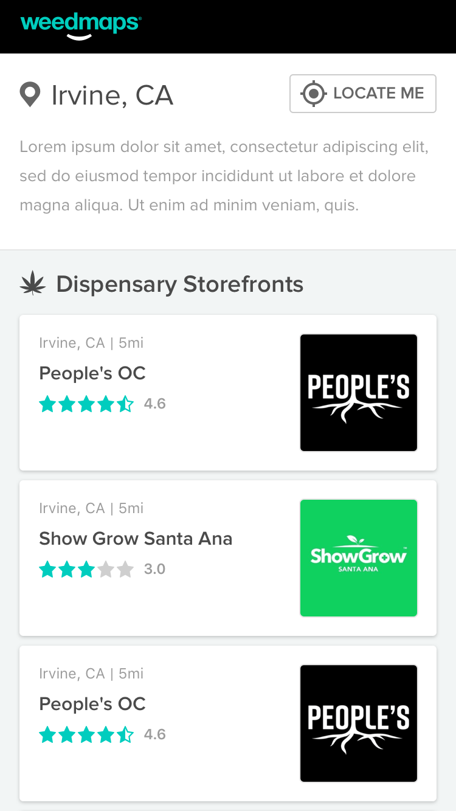
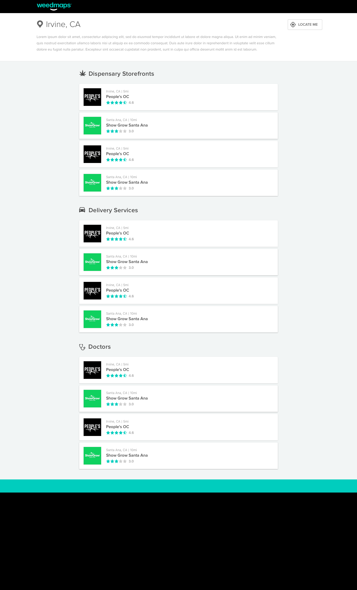

# Weedmaps Frontend Code Challenge

###### Table of Contents

- [Prerequisites](#prerequisites)
- [Installation](#installation)
- [Challenge Requirements](#challenge-requirements)
  1. [UI Styling](#part-1-ui-styling)
  2. [Debugging](#part-2-debugging)
  3. [Logic](#part-3-logic)
  4. [Testing](#part-4-testing)
- [Architecture](#architecture)
- [Delivering Your Challenge](#delivering-your-completed-challenge)
- [API Documentation](#weedmaps-listing-api-documentation)

## Prerequisites

- **You'll need Node `>= 12` installed.** We recommend leveraging
  [nvm](https://github.com/creationix/nvm) to switch Node versions between projects.
- Install [yarn](https://yarnpkg.com/en/docs/install) if you don't already have it.

## Installation

- Ensure you're running a modern version of NodeJS as mentioned above
- From this project root, run `$ yarn install`
- To start the development server, run `$ yarn start`
- Your browser should automatically open at `http://localhost:3000` and will reload on subsequent file changes

#### Available Scripts

| Command      | Description                   |
| ------------ | ----------------------------- |
| `yarn start` | Starts the development server |
| `yarn test`  | Starts the test runner        |
| `yarn tsc`   | Checks Typescript types       |

## Challenge Requirements

There are four parts that should be completed for this code challenge: [UI Styling](#part-1-ui-styling), [Debugging](#part-2-debugging), [Logic](#part-3-logic), and [Testing](#part-4-testing). Each of the areas are documented in more detail below. They are of equal importance and should be completed to the best of your ability. For example, building a beautiful UI is appreciated but it should also be supported by a solid test suite.

### Part 1: UI Styling

Attention to detail and an aesthetic sensibility are appreciated just as much clean and performant code. The user-interface should be responsive and free of visual artifacts e.g. text wrapping, UI alignment, etc.

- UI components in this project are setup to use [Styled Components](https://www.styled-components.com/), a popular CSS-in-JS library we use in Production. It's encouraged that all new styles follow this pattern rather than adding another CSS pre-processor such as SCSS.
- Any existing UI should be styled to match the mockups referenced below. We're looking to see how you approach the CSS architecture and the techniques used to style the components.
- There are some basic styles included. The list of Storefronts, Deliveries, and Doctors rendered after clicking on the Locate Me button needs to be styled to match the mockups.
- The rating for each Listing should be rendered as a Star Rating component instead of a raw numerical value. This should be a custom solution of your own without installing a third-party library. Your implementation should account for non-whole values and take client-side performance into consideration.
- The UI should be responsive across viewports and match the mockups below for both mobile and desktop.

#### Design Mockups

<table>
   <thead>
      <tr>
         <th>Mobile</th>
         <th>Desktop</th>
      </tr>
   </thead>
   <tbody>
      <tr>
         <td valign="top">
            
         </td>
         <td valign="top">
            
         </td>
      </tr>
   </tbody>
</table>

### Part 2: Debugging

There is an existing bug in this code base when clicking on the `Locate Me` button which prevents the Listings data from being rendered. The objective is to find the bug, fix it, and write a test to cover the edge case where appropriate.

### Part 3: Logic

When clicking on one of the Listing cards a detail page needs to be rendered to the User. There are no design mockups for this step, so feel free to reuse any existing styles or design language. You can choose to either implement this as either a "popover" style UI component or as an entirely new page. The documentation for the requisite API can be found [here](#weedmaps-listing-api-documentation) and the requirements for this feature are as follows:

1. The URL must change and support the ability to refresh the page and maintain the proper state.
2. The Listing `avatar_image`, `name`, `rating`, `phone_number`, `address`, and `business_hours` fields should be rendered on the page.

**Note:** Feel free to add any libraries that you feel would enchance the codebase or help satisfy the requirements around routing, etc.

### Part 4: Testing

This section of the challenge is to display your ability to adequately test your application. Implement thorough testing with [React Testing Library](https://testing-library.com/docs/react-testing-library/intro). **Strive for high quality test coverage of all critical paths rather than 100% test coverage.**

## Architecture

The state of the application should be managed through React context and hooks. Components should utilize data from a global context. The general structure of the application has been provided and should look similar to the following:

```
src
├── __test__
│   └── mocks
│       ├── coord-mock.json
│       └── location-mock.json
├── assets
│   └── logo.png
├── components
│   ├── App.tsx
│   ├── App.test.tsx
│   ├── avatar
│   │   └── index.tsx
│   ├── listing_card
│   │   └── index.tsx
│   ├── listing_cards
│   │   └── index.tsx
│   └── styles.tsx
├── constants
│   └── config.js
├── context
│   └── index.tsx
├── icons
│   ├── delivery.tsx
│   ├── dispensary.tsx
│   ├── doctor.tsx
│   ├── locate.tsx
│   └── map-pin.tsx
|   └── icon.d.ts
├── index.tsx
├── react-app-env.d.ts
├── setupTests.tsx
└── test-utils.tsx
```

## Delivering Your Completed Challenge

- Please do NOT include any `.git` history or `/node_modules` directories
- Zip your completed work and submit it through the URL provided near the bottom of the original code challenge email

## Weedmaps Listing API Documentation

Given a request, this API will return the listings info based on the listing `wmid` parameter used from the location response. `https://api-g.weedmaps.com/discovery/v1/listings/{wmid}`

#### Example Request:

```shell
$curl -X GET "https://api-g.weedmaps.com/discovery/v1/listings/761452730" -H "user-agent: node/fetch" -H "accept: application/json"
```

#### Example Response:

```
{
  "data": {
    "listing": {
      "id": 64129,
      "name": "The Roots Dispensary",
      "slug": "the-roots-dispensary",
      "state": "California",
      "best_of_weedmaps": true,
      "social_equity": false,
      "city": "Lompoc",
      "type": "dispensary",
      "wmid": 761452730,
      "latitude": 34.644147,
      "longitude": -120.467125,
      "web_url": "https://weedmaps.com/dispensaries/the-roots-dispensary",
      "package_level": "listing_plus",
      "feature_order": 1,
      "ranking": 4.882747617550788,
      "rating": 4.92409638554217,
      "reviews_count": 830,
      "avatar_image": {
        "small_url": "https://images.weedmaps.com/dispensaries/000/064/129/avatar/square_fill/1594838894-Black_Teal_Weed_Maps.jpg",
        "original_url": "https://images.weedmaps.com/dispensaries/000/064/129/avatar/original/1594838894-Black_Teal_Weed_Maps.jpg"
      },
      "license_type": "hybrid",
      "address": "805 W Laurel Ave",
      "distance": null,
      "zip_code": "93436",
      "timezone": "America/Los_Angeles",
      "intro_body": "<p></p><p> </p><p><strong>WE NEVER LEAVE OUR ROOTS, WE ONLY GROW NEW BRANCHES</strong></p><p> </p><p><strong>Welcome to The Roots Dispensary</strong>–<em>. </em>At The Roots Dispensary we proudly serve the Lompoc, Santa Maria, Solvang and Buelton community with selected quality cannabis products at a competitive price. </p><p> </p><p><strong>THE ROOTS IN-STORE DAILY DEALS</strong></p><p>*<strong>Munchie Mondays</strong>- 10% Off ALL Edibles ALL Day </p><p>*<strong>Terpy Tuesdays</strong>- 10% Off ALL Cartridges/Pods ALL Day</p><p>*<strong>Waxy Wednesdays</strong>- 10% Off ALL Concentrates ALL Day</p><p>*<strong>Thirsty Thursdays</strong>- 10% Off ALL Drinks ALL Day</p><p>*<strong>Flower Fridays</strong>- 10% Off ALL Flower ALL Day</p><p>*<strong>CBD Saturdays</strong>- 10% Off ALL CBD Products ALL Day</p><p>*<strong>Sundaze Smoke Sesh</strong>- Taxes On Us!!!</p><p><strong>**Wake N Bake- 20% Off Entire Purchase From 9am-10am (Everyday)**</strong></p><p><strong>**Happy Hour-15% OFF Entire Purchase 4pm-5pm(Everyday)**</strong></p><p><br></p><p> </p><p><em>*Cannot Be Combined With Other Specials or Promotions. Can be canceled anytime at dispensaries discretion. Specials not valid for deliveries.</em></p><p> </p><p> </p><p><strong>The Roots Dispensary team is committed to delivering exceptional customer service and educational insight. We encourage customers to come in and speak with our friendly and knowledgeable staff to find out what form of cannabis best suits your needs. </strong></p><p> </p>",
      "support_cause_link": null,
      "gofundme_link": null,
      "static_map_url": "https://staticmap.weedmaps.com/static_map/13/34.644147/-120.467125/402/147/map.png",
      "open_now": true,
      "closes_in": 660,
      "todays_hours_str": " 9:00am -  9:00pm",
      "min_age": 21,
      "menu_items_count": 454,
      "verified_menu_items_count": 0,
      "endorsement_badge_count": 0,
      "is_published": true,
      "online_ordering": {
        "after_hours_enabled": true,
        "enabled_for_pickup": true,
        "enabled_for_delivery": false,
        "identification_required": true,
        "purchase_min": {
          "cents": 0,
          "currency": "USD",
          "amount": 0
        },
        "fee": {
          "cents": 0,
          "currency": "USD",
          "amount": 0
        },
        "eta_min": 30,
        "eta_max": 60,
        "display_eta": false,
        "wm_service_fee": {
          "cents": 0,
          "currency": "USD",
          "amount": 0
        }
      },
      "retailer_services": [
        "storefront",
        "pickup"
      ],
      "has_curbside_pickup": true,
      "has_featured_deal": false,
      "adzerk_advertiser_id": 0,
      "description": "<p></p><p><strong>**21 FOR ADULT USE**  </strong></p> <p><em>** Also servng patients age 18 to 20 with valid doctors recommendation!!**</em></p> <p>~<strong>FULLY LICENSED AND COMPLIANT DISPENSARY-</strong></p> <p>--------------------------------------</p> <p><strong>*WEEDMAPS ORDERS CANNOT PARTICIPATE IN PAD SPECIALS.*</strong></p> <p>***We are constantly updating our menu all day, everyday, as we run out of items, and restock daily. Please be patient with us. If you have ANY questions about what we may or may not have in stock, feel free to give us a call and we will gladly check for you! We apologize in advance but any questions regarding price may not be discussed over the phone. Thank You!***</p>",
      "first_time_announcement": "<p></p><p>First time visitors Sign up for our <strong>Loyalty Rewards</strong> program. Sign-up includes the option to redeem your points for a 10% off coupon, OR save those points for another deal. </p> <p><strong>**See Details Section For Daily Deals**</strong></p> <p> </p>",
      "announcement": "<p></p><p><strong>**All Menu items include the mandatory State Excise Tax** (California sales tax of 7.75% not included in menu pricing) test</strong></p>",
      "announcement_updated_at": "2020-05-05T21:32:30.637Z",
      "country": "US",
      "phone_number": "(805) 322-8032",
      "email": "hello@visittheroots.com",
      "website": "http://www.visittheroots.com",
      "has_handicap_access": true,
      "has_photos": false,
      "has_videos": false,
      "accepts_credit_cards": false,
      "has_testing": false,
      "is_recreational": false,
      "has_atm": true,
      "has_security_guard": true,
      "is_verified_seller": false,
      "has_endorsement_badges": false,
      "has_age_gate": true,
      "license_number": "C10-0000335-LIC",
      "licenses": [
        {
          "type": "Adult-Use Retail",
          "number": "C10-0000335-LIC"
        }
      ],
      "business_hours": {
        "sunday": {
          "open": "9:00am",
          "close": "6:00pm"
        },
        "monday": {
          "open": "9:00am",
          "close": "9:00pm"
        },
        "tuesday": {
          "open": "9:00am",
          "close": "9:00pm"
        },
        "wednesday": {
          "open": "9:00am",
          "close": "9:00pm"
        },
        "thursday": {
          "open": "9:00am",
          "close": "9:00pm"
        },
        "friday": {
          "open": "9:00am",
          "close": "9:00pm"
        },
        "saturday": {
          "open": "9:00am",
          "close": "9:00pm"
        }
      },
      "social": {
        "facebook_id": "@therootsdispensary",
        "instagram_id": "therootsdispensary",
        "twitter_id": "@therootslompoc",
        "youtube_ids": []
      },
      "region": {
        "id": 590,
        "name": "Lompoc / Solvang",
        "slug": "lompoc-solvang",
        "region_path": "united-states/california/lompoc-solvang"
      },
      "member_since": "2019",
      "price_aggregations": {
        "unit": {
          "units": "1",
          "min": 3,
          "max": 95
        },
        "gram": [
          {
            "units": "1/2",
            "min": 5.5,
            "max": 45
          },
          {
            "units": "1",
            "min": 6.5,
            "max": 90
          }
        ],
        "ounce": [
          {
            "units": "1/8",
            "min": 20,
            "max": 60
          },
          {
            "units": "1",
            "min": 165,
            "max": 165
          },
          {
            "units": "1/4",
            "min": 45,
            "max": 95
          },
          {
            "units": "1/2",
            "min": 170,
            "max": 170
          }
        ]
      },
      "promo_code": null
    }
  }
}
```
